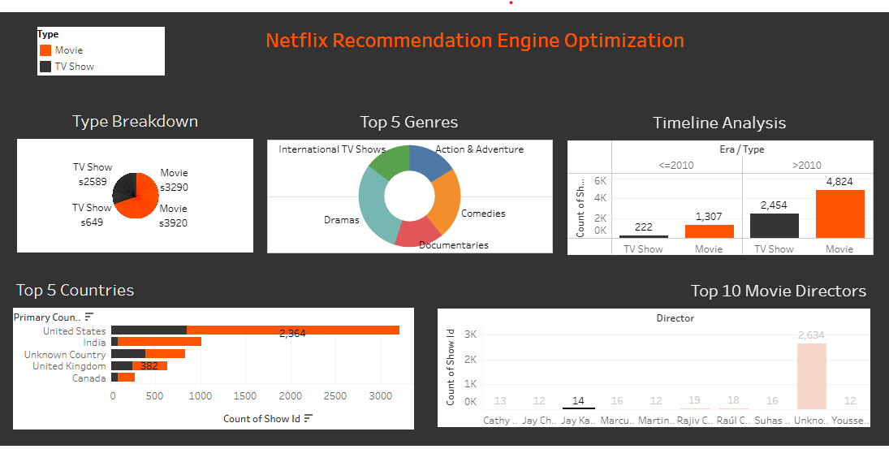

# Netflix Content & Recommendation Engine Optimization

An end-to-end data analytics project analyzing Netflix's catalog using Python for data cleaning and Tableau for dashboard visualization.

## 📌 Features
- **Data Cleaning:** Handled null values, parsed dates, and categorized eras/genres using Python (`pandas`).
- **Interactive Visualizations:**
  - Content type distribution (Movie vs. TV Show).
  - Top 5 genres for movies.
  - Release timeline analysis (<=2010 vs. >2010).
  - Top content-producing countries.
  - Top 10 movie directors.

## 🛠️ Tech Stack
- **Python:** Pandas, NumPy
- **BI Tool:** Tableau Desktop / Tableau Public